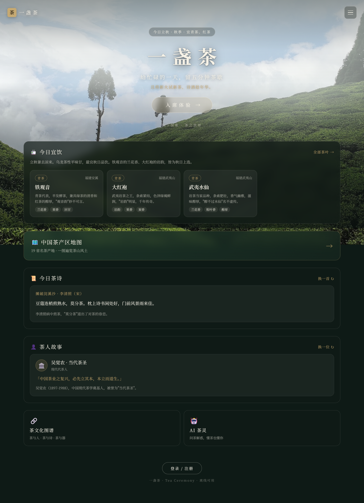

# 一盏茶 · Tea Ceremony

An immersive online tea ceremony experience: from entering the tea room, choosing tea and teaware, boiling water and brewing, to structured tasting records — a complete digital tea session.

[中文](README.md) | **English**

[](https://github.com/qiuqianyi66/tea-ceremony/actions/workflows/ci.yml)
[](https://vuejs.org/)
[](https://www.typescriptlang.org/)
[](docker-compose.yml)

Live static demo (GitHub Pages): [qiuqianyi66.github.io/tea-ceremony](https://qiuqianyi66.github.io/tea-ceremony/)

## Why this project

Most "tea culture" products stop at content display. **Tea Ceremony** turns cultural content into an actionable, feedback-driven, continuously recordable digital experience: pick your tea and teaware, control water temperature and steeping time, then complete a tasting based on liquor color, aroma and mouthfeel.



## Core experience

- **Tea room entrance**: time, solar term, themed tea room and ambient sound form an immersive home page
- **Tea & teaware selection**: six tea categories, teaware unlocks, water source choices and cultural archives
- **Real interactive brewing**: leaf-dose adjustment, temperature control, boiling/steam/liquor/outflow feedback, multi-infusion brewing
- **Structured tasting**: observe color → smell aroma → taste, with an eight-dimension score and craft coefficient
- **Shareable tasting card**: one-click QR code / share link / PNG with embedded QR — recipients open a read-only share page to view the session
- **Personal growth**: IndexedDB offline history, XP, achievements and teaware collection
- **AI tea spirit**: tea-culture RAG retrieval + LLM, falling back to rule-based replies when the network is unavailable
- **PWA & deployment**: installable and offline-capable, one-command Docker Compose startup for frontend, backend and PostgreSQL


## Technical highlights

### Offline-first data layer

The frontend wraps IndexedDB with Dexie.js: tasting records are written locally first, then synced to the server; failed records retry automatically when the network recovers. Finishing a tasting never depends on connectivity, and data is never lost to a single failed request.

### Explainable scoring model

Tasting results combine an eight-dimension mouthfeel score with a brewing-craft coefficient. Water temperature, steeping time, teaware and water source all affect the outcome, leaving room to grow into a more complete tea-ceremony model.

### Frontend/backend separation & security boundary

Vue 3 + Pinia + Vue Router handle interaction and state; FastAPI + SQLAlchemy + PostgreSQL handle accounts, tasting records and cultural retrieval; Nginx handles SPA fallback, API proxying, caching and security headers.

### Verifiable engineering pipeline

GitHub Actions runs on every push and Pull Request:

- Vue/TypeScript type checking
- Frontend unit tests (Vitest + fake-indexeddb, scoring & offline-storage loop)
- Playwright end-to-end tests (full journey: home → enter → select tea → teaware → brew → taste → save)
- Production build
- Backend API tests (pytest, in-memory SQLite)
- Database migration tests (real PostgreSQL, Alembic upgrade/rollback round-trip)
- Python byte-compile check
- Docker Compose configuration validation

## Project structure

```text
tea-ceremony/
├─ src/
│  ├─ views/              # tea room, select, brew, taste, tea spirit pages
│  ├─ components/         # liquor, chart, brewing interaction components
│  ├─ stores/             # Pinia business state
│  ├─ services/           # API, IndexedDB, scoring, AI services
│  ├─ data/               # teas, teaware, solar terms and cultural archives
│  └─ router/             # routes and brewing-flow guards
├─ backend/
│  ├─ app/routers/        # auth, teas, records, culture, ai API
│  ├─ app/services/       # cultural retrieval and text chunking
│  └─ seeds/              # seed teas and cultural data
├─ .github/               # CI, issue and PR templates
├─ docker-compose.yml
└─ nginx.conf
```

## Local development

### Frontend only

```bash
npm install
npm run dev
```

The local dev environment requests `http://localhost:8000/api` by default. If you only want to try the frontend, the built-in tea catalog and IndexedDB still work.

The GitHub Pages demo uses the built-in tea catalog and browser local storage; full account-sync features require running the Docker backend.

### Full stack

```powershell
Copy-Item .env.example .env
# edit .env, set SECRET_KEY and PostgreSQL password
npm run build
docker compose up -d --build
```

Import seed data on first launch:

```bash
docker compose exec backend python -m seeds.run
```

## Commands

```bash
npm run dev          # dev server
npm run type-check   # Vue/TypeScript type checking
npm run build        # type checking + production build
npm run preview      # preview production build
npm run smoke        # smoke-test main routes in production preview
npm run test         # frontend unit tests (Vitest)
npm run test:e2e     # Playwright E2E (first run: npx playwright install chromium)
```

Backend tests (Python 3.12):

```bash
cd backend
pip install -r requirements-dev.txt
python -m pytest tests -q                    # API tests (in-memory SQLite)
TEST_DATABASE_URL=postgresql://... python -m pytest tests/test_migrations.py -q  # migration tests (real Postgres; auto-skipped if unset)
```

> Migration tests run `alembic downgrade base` against the `TEST_DATABASE_URL` database — always use a dedicated test database.

## Resume summary

> Independently designed and developed an immersive online tea-ceremony app, building the complete select-brew-taste loop with Vue 3, TypeScript, Pinia, Dexie.js, FastAPI, PostgreSQL and Docker; implemented IndexedDB offline-first storage with retry, an explainable rule-based scoring model, shareable tasting cards, tea-culture RAG retrieval and AI fallback; routed AI requests through a backend proxy with API rate limiting, unified error format, server logging and health checks; automated type-checking, unit tests, Playwright E2E, backend tests and Compose validation via GitHub Actions.

## Roadmap

- Real tea liquor & teaware photography, demo screenshots and short video
- Tasting-record analytics dashboard (personal growth curves)
- Redis-based distributed rate limiting and external error tracking (Sentry) for production

## License

MIT © 2026 严恒 (qiuqianyi66)
