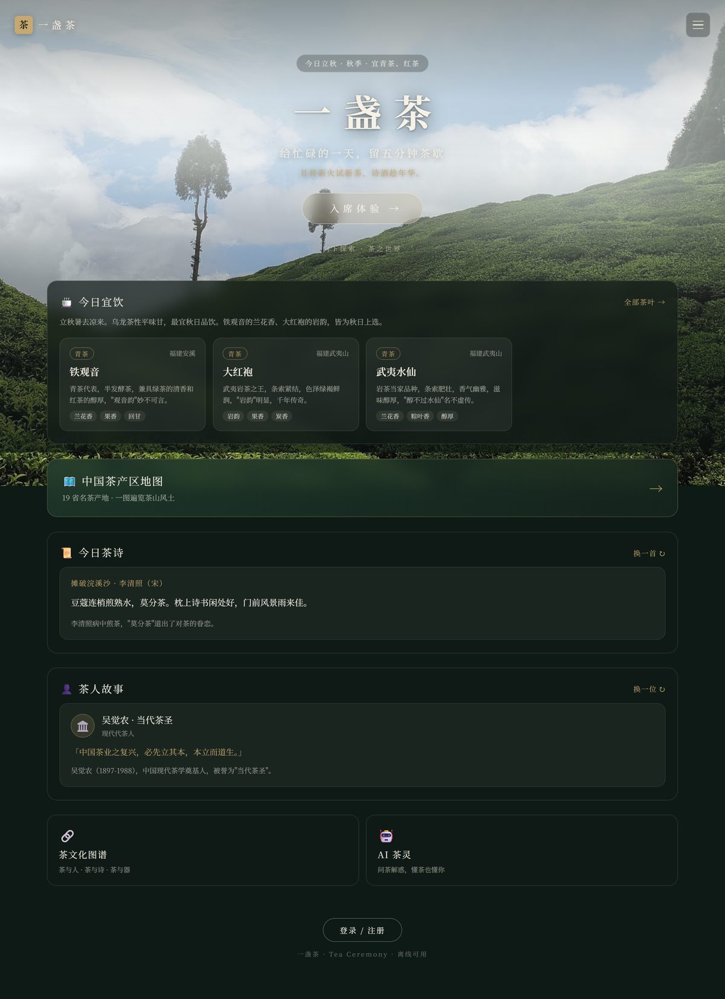
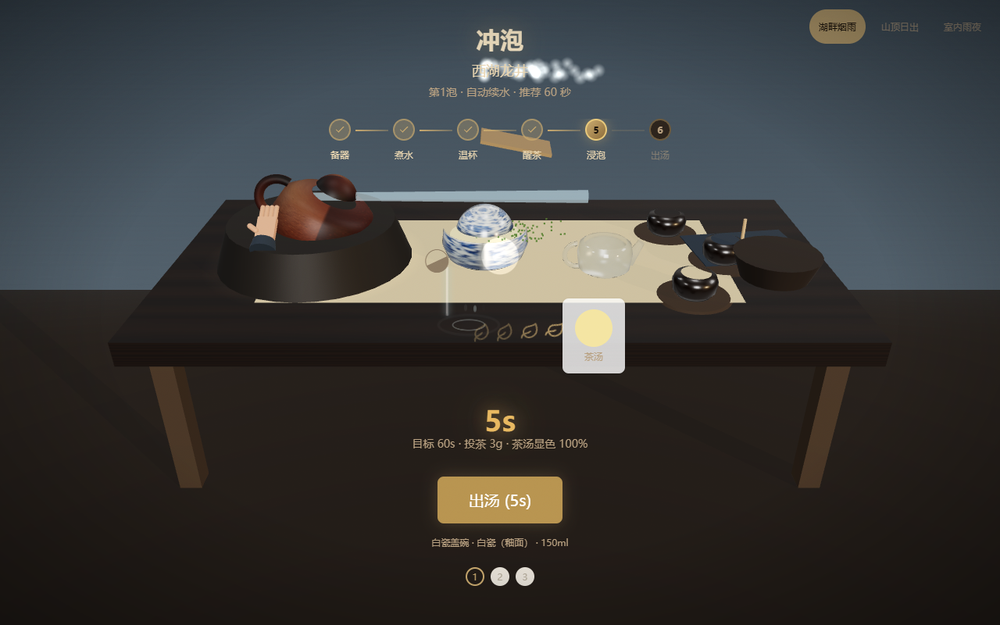
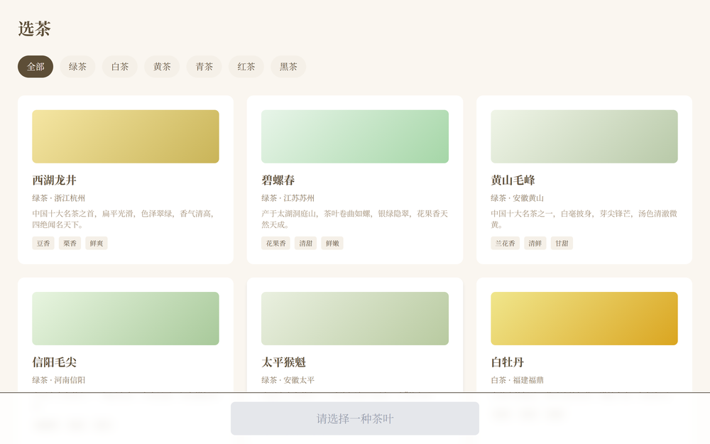
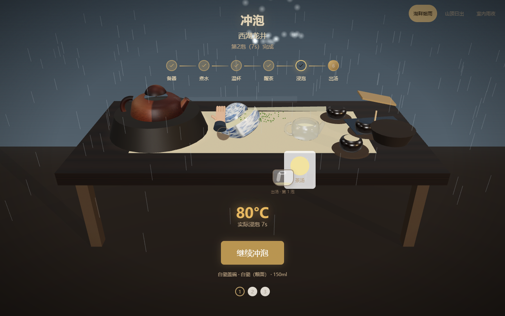
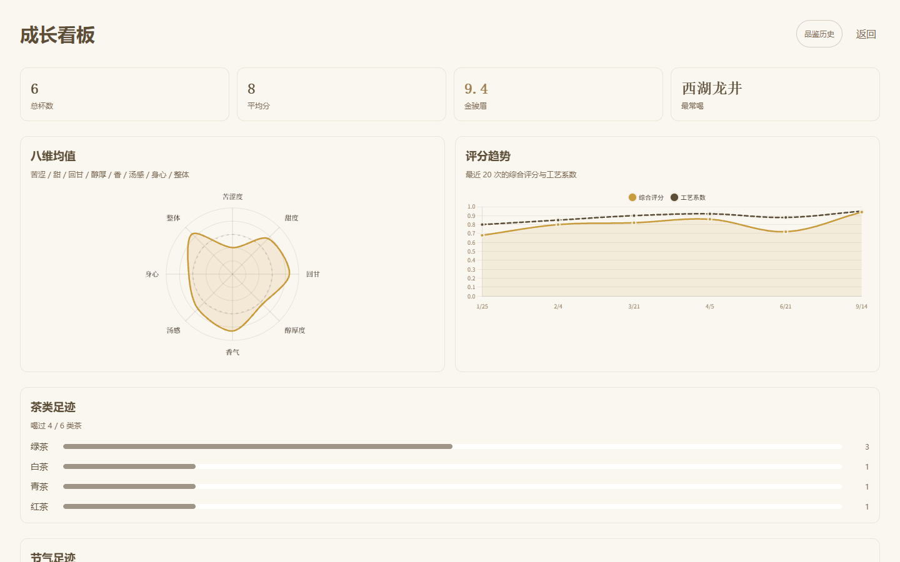

# 一盏茶 · Tea Ceremony

> 一席茶，一方天地，一念清心。

沉浸式在线茶道：入席、选茶、煮水、冲泡、品鉴——在浏览器里走完一场完整的工夫茶。
不是百科，不是计时器，是一座可以走进去的数字茶室。

**中文** | [English](README.en.md)

[](https://github.com/qiuqianyi66/tea-ceremony/actions/workflows/ci.yml)
[](https://vuejs.org/)
[](https://www.typescriptlang.org/)
[](https://web.dev/learn/pwa/)
[](LICENSE)

## 立即体验

👉 **在线 Demo（无需注册，离线可用）**：[qiuqianyi66.github.io/tea-ceremony](https://qiuqianyi66.github.io/tea-ceremony/)


## 它是什么

大多数"茶文化"产品停在图文介绍。「一盏茶」把文化变成可操作、可反馈、可记录的一次茶事：

- **3D 茶席**：TresJS / Three.js 渲染的木桌茶器，注水有蒸汽，出汤看汤色，时间、节气、主题茶室影响氛围
- **完整流程闭环**：备器 → 煮水 → 温杯 → 醒茶 → 冲泡 → 观色 → 闻香 → 品味，八维口感评分 × 冲泡工艺系数
- **离线优先**：Dexie.js + IndexedDB，品鉴记录先落本地，断网也能泡，联网后自动同步
- **可分享**：一键生成带二维码的品鉴卡 PNG / 只读分享链接，把这席茶送给朋友
- **AI 茶灵**：茶文化 RAG 检索 + LLM，网络不可用时自动降级到规则回复

## 核心界面

| 沉浸式首页 | 3D 冲泡 | 品鉴分享卡 |
| --- | --- | --- |
|  |  |  |





## 为什么做

为三种人做的：

1. **想学茶但嫌麻烦的人**——要引导、要氛围，不想一上来就背六大茶类
2. **有品茶习惯的人**——要记录、要沉淀，喝完一杯有迹可循
3. **慢生活人群**——要陪伴感，五分钟不被打扰的茶歇

坚持：无广告、无付费墙、可自托管、离线可用。

## 技术栈

| 层 | 技术 |
| --- | --- |
| 前端 | Vue 3 + TypeScript（strict）+ Pinia + Vue Router + Tailwind CSS + Vite |
| 3D | Three.js / TresJS（KTX2 压缩贴图 + basis transcode） |
| 数据 | Dexie.js + IndexedDB（离线优先，`sync_status` 重试队列） |
| 后端 | FastAPI + SQLAlchemy 2.0（异步）+ PostgreSQL + Pydantic v2 + Alembic |
| AI | 后端代理转发（浏览器禁止直连第三方），DeepSeek，失败降级到规则引擎 |
| 部署 | Windows Server 原生（NSSM + uvicorn + nginx for Windows），GitHub Pages 静态 Demo |
| 测试 | Vitest + fake-indexeddb、Playwright E2E、pytest + Alembic 迁移往返 |
| CI | GitHub Actions：类型检查 / 单测 / E2E / 构建 / 后端测试 / 迁移测试 / Compose 校验 |

## 快速开始

只玩前端（推荐先跑这个）：

```bash
npm install
npm run dev
```

完整全栈（需要本地 PostgreSQL + Python 3.12）：

```powershell
Copy-Item .env.example .env   # 编辑 SECRET_KEY、DATABASE_URL
cd backend
python -m venv .venv
.\.venv\Scripts\pip install -r requirements.txt
.\.venv\Scripts\alembic upgrade head
.\.venv\Scripts\python -m seeds.run
.\.venv\Scripts\uvicorn main:app --reload --port 8000
```

常用命令：`npm run type-check` · `npm run test` · `npm run build` · `npm run test:e2e`
后端测试：`cd backend && .\.venv\Scripts\python -m pytest tests -q`

完整部署、架构说明、设计规范见：[DEPLOY.md](DEPLOY.md) · [CONTEXT.md](CONTEXT.md) · [DESIGN_SPEC.md](DESIGN_SPEC.md) · [3D_SPEC.md](3D_SPEC.md)

## 参与贡献

欢迎从 Good First Issue 入手——补茶名数据、补英文翻译、补测试、补茶器图标都算。
流程见 [CONTRIBUTING.md](CONTRIBUTING.md)，Issue 和 PR 模板已就位。

## 路线图

- 真实茶汤与茶器摄影素材替换占位图
- 茶单扩充到中国茶区主要品类（当前 40 款，目标 100+）
- 多人共席（分享卡从只读进化到双人茶会）
- 生产环境接入 Sentry 错误追踪与 Redis 限流

## 素材致谢

首页茶山背景 `src/assets/tea-mountain-hero.jpg`：摄影作者 Tanmoy281，来源 [Wikimedia Commons](https://commons.wikimedia.org/wiki/File:Darjeeling-tea-plantation.jpg)，[CC BY-SA 4.0](https://creativecommons.org/licenses/by-sa/4.0/deed.zh)；本项目仅做尺寸缩放与晨雾色调处理。
茶叶摄影：Pexels 可商用素材。

## License

[MIT](LICENSE) © 2026 严恒（qiuqianyi66）
