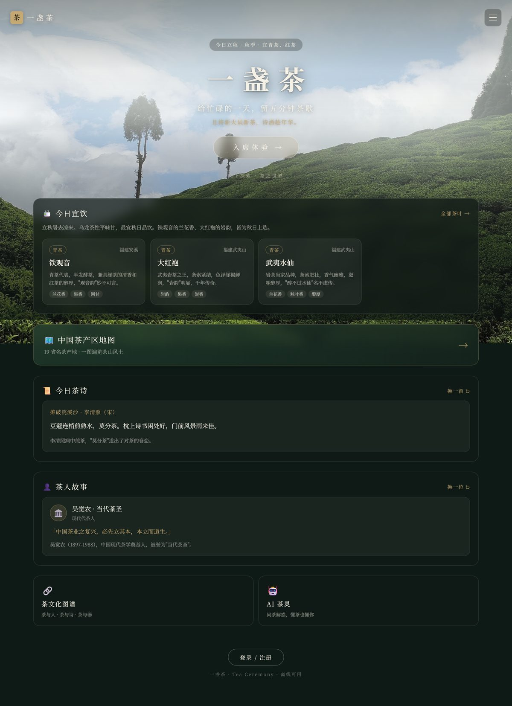
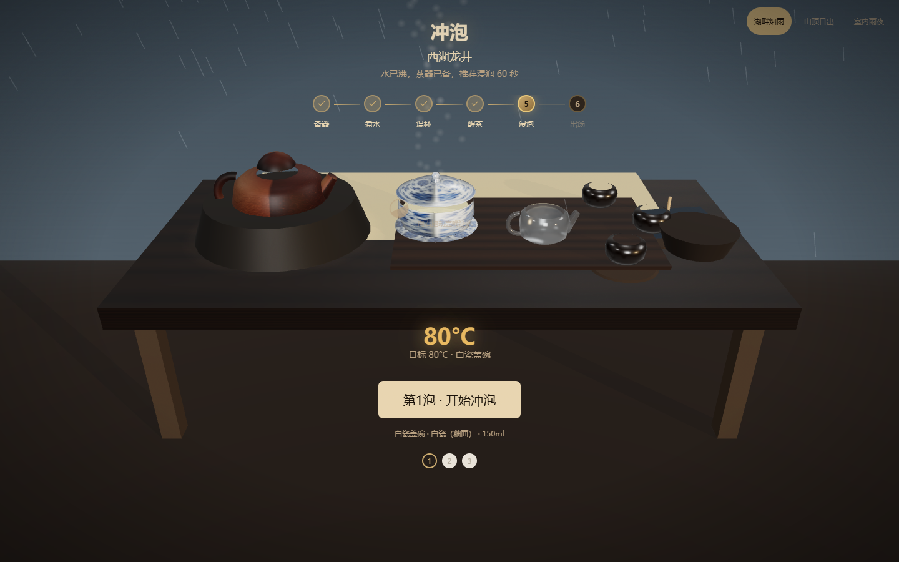
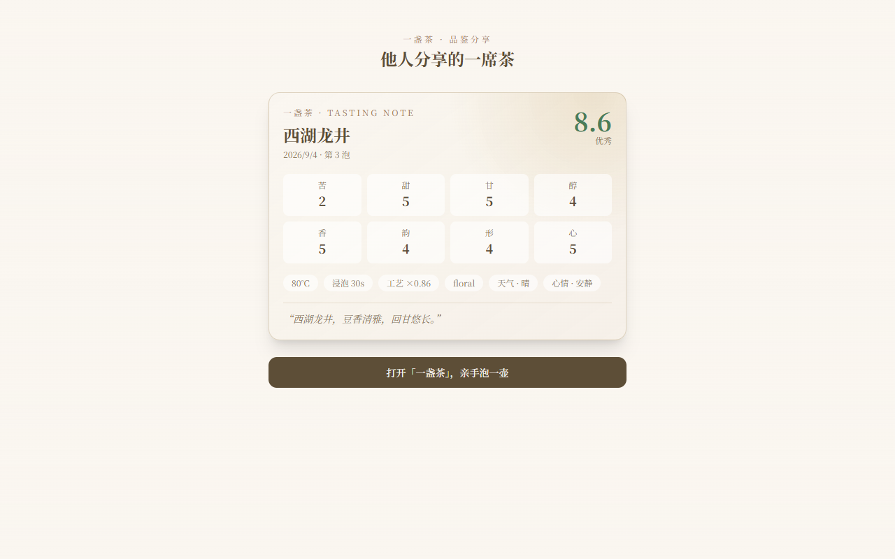
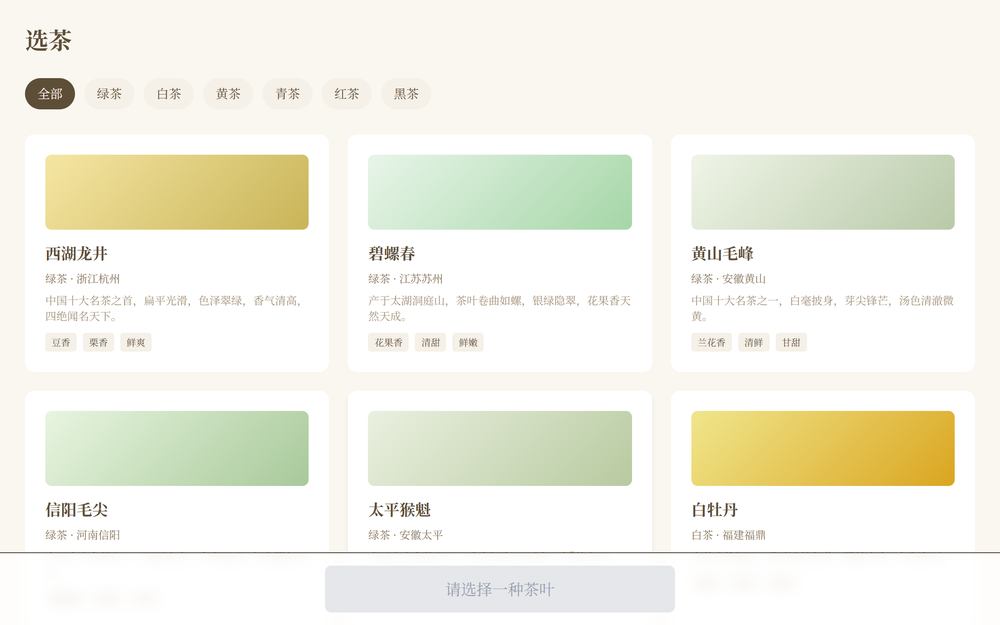
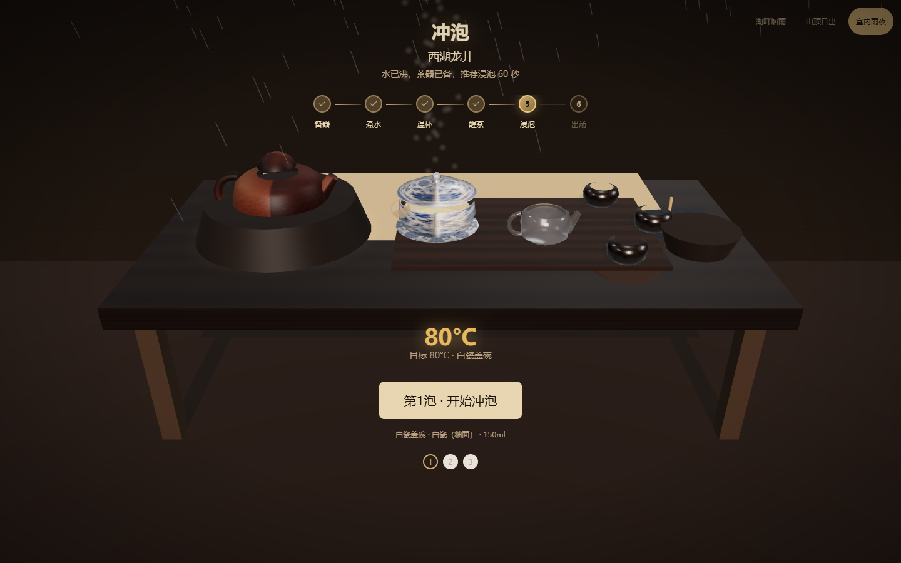
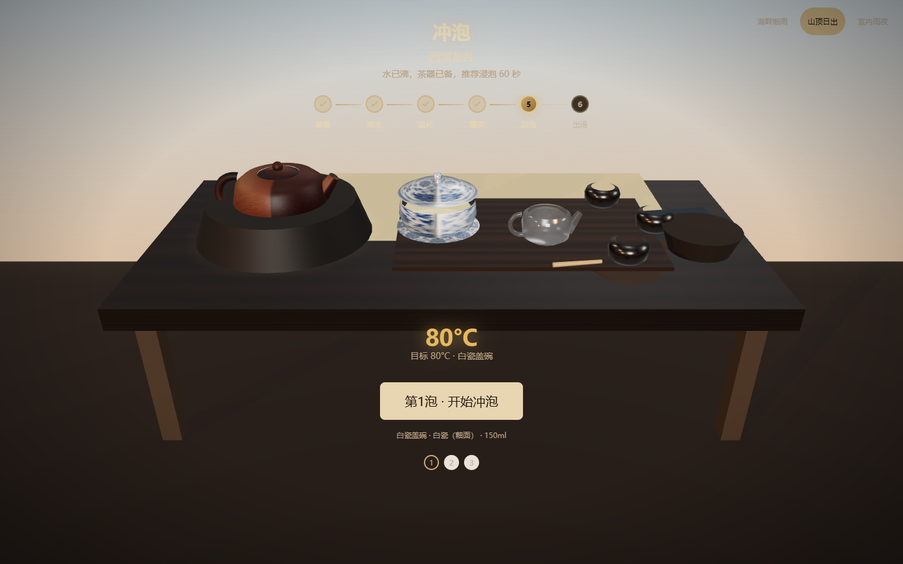
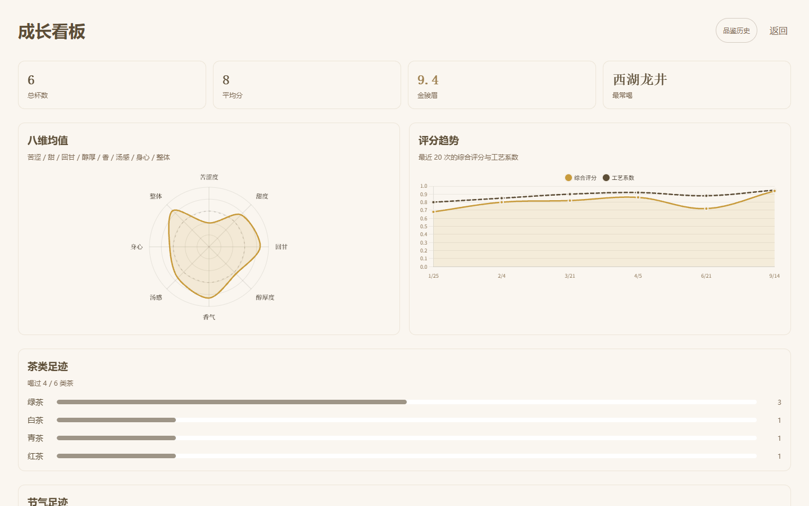

# 一盏茶 · Tea Ceremony

**一座开在浏览器里的数字茶室。** Vue 3.5 + Three.js 渲染 3D 茶席，Spring Boot 3.5 + Spring AI Alibaba 提供 RAG 问答与多工具 Agent，Dexie 让泡茶断网也能继续。在线 Demo 免注册，MIT 许可。

一盏茶（Tea Ceremony）是一个开源的在线茶道 Web 应用。不是茶文化百科，不是泡茶计时器：选茶、煮水、注水、出汤、品鉴，一整套流程在一张 3D 茶席上走完，断网也能走完。

## 快速了解

| 项 | 事实 |
| --- | --- |
| 项目定位 | 沉浸式在线茶道应用。不是茶文化百科，也不是泡茶计时器 |
| 在线体验 | [qiuqianyi66.github.io/tea-ceremony](https://qiuqianyi66.github.io/tea-ceremony/)（免注册，可离线） |
| 前端 | Vue 3.5 · TypeScript 6（strict）· Pinia 4 · Tailwind CSS 4 · Vite 8 |
| 3D | Three.js 0.185 · TresJS 5.8；茶器由参数化 Lathe / Box 几何加程序化贴图生成，零外部模型资产 |
| 后端 | Spring Boot 3.5 · Spring Data JPA · Spring AI Alibaba · PostgreSQL + pgvector |
| 离线能力 | Dexie.js + IndexedDB 离线优先，品鉴记录先落本地，联网按 `sync_status` 回传 |
| 测试与门禁 | Vitest · Playwright E2E · axe 无障碍 · Maven Testcontainers · ArchUnit 分层；CI 14 个合并门禁 job |
| 工程文档 | 30 份 ADR，每份写「选 A 理由 + 否 B 理由 + 反转条件」 |
| 数据规模 | 66 款茶 · 21 条路由 · 中式茶席 3 套皮肤（湖畔烟雨 / 山顶日出 / 室内雨夜） |
| 许可 | MIT。可商用、可二次开发，保留版权声明 |

**你是谁？**

| 我是来体验的 | 我是开发者要跑起来 | 我在看技术栈 / 简历项目 |
| --- | --- | --- |
| 👉 [在线 Demo](https://qiuqianyi66.github.io/tea-ceremony/)（离线可用） | 👉 [快速开始](#快速开始) | 👉 [技术栈](#技术栈) · [AI 能力](#ai-能力) · [工程质量](#工程质量) |

[](LICENSE)
[](https://vuejs.org/)
[](README.md)
[](README.md)

[](https://github.com/qiuqianyi66/tea-ceremony/actions/workflows/ci.yml)

**中文** · [English](README.en.md)

## 目录

- [它是什么](#它是什么)
- [和别的茶 App 有什么不同](#和别的茶-app-有什么不同)
- [立即体验](#立即体验)
- [能做什么](#能做什么)
- [截图](#截图)
- [技术栈](#技术栈)
- [AI 能力](#ai-能力)
- [项目结构](#项目结构)
- [快速开始](#快速开始)
- [工程质量](#工程质量)
- [常见问题](#常见问题)
- [路线图](#路线图)
- [致谢](#致谢)
- [License](#license)

## 它是什么

「一盏茶」不是百科、不是计时器，是一座可以走进去的数字茶室。

想象一下：打开浏览器，木桌、紫砂壶、80℃ 山泉水缓缓注入，蒸汽升起，汤色渐透。结束后八维口感打个分，下次 AI 茶灵记得你的口味偏好。

业务闭环：入席 → 选茶 → 备器 → 煮水 → 冲泡 → 品鉴记录 → 个人成长。前端用 Vue 3 + Three.js 渲染可交互的 3D 茶席，后端用 Spring Boot 3.5 + Spring AI Alibaba 提供 RAG 问答与多工具 Agent，数据层 PostgreSQL + pgvector 支撑向量检索。

## 和别的茶 App 有什么不同

- 不做茶知识百科：66 款茶的介绍只是原料，真正被记录的是这一泡怎么泡、味道如何。
- 不做泡茶计时器：计时只是流程里的一环，走完是备器、煮水、温杯、醒茶、冲泡、观色、闻香、品味。
- 不用外部 3D 模型资产：茶器由参数化几何与程序化贴图现场生成，仓库里没有 glb 文件，也没有贴图包要下载。
- 不把 AI 放在浏览器直连：请求全走 `/api/v1/ai/*` 后端代理，拿不到时就降级成本地规则回复。

## 立即体验

- **在线 Demo（无需注册，离线可用）**：[qiuqianyi66.github.io/tea-ceremony](https://qiuqianyi66.github.io/tea-ceremony/)
- **完整版（含后端，公网部署）**：[https://42.121.125.4](https://42.121.125.4/)


## 能做什么

- **3D 茶席**：TresJS / Three.js 渲染的木桌与茶器，木茶盘承托盖碗、公道杯、品杯与炭炉；注水有蒸汽，出汤看汤色，皮肤（湖畔烟雨 / 山顶日出 / 室内雨夜）改变光线与天气
- **完整流程闭环**：备器 → 煮水 → 温杯 → 醒茶 → 冲泡 → 观色 → 闻香 → 品味，八维口感评分 × 冲泡工艺系数
- **离线优先 PWA**：Dexie.js + IndexedDB，品鉴记录先落本地，断网也能泡，联网后自动同步（`sync_status` 重试队列）
- **可分享**：一键生成带二维码的品鉴卡 PNG 与只读分享链接
- **AI 茶灵**：五角色专家 + 多工具 Agent + SSE 流式回复 + 跨会话长期记忆，RAG 答案带 sources 可溯源
- **工程化**：30 份 ADR、ArchUnit 分层测试、Testcontainers 集成测试，14 个 CI 门禁 job 见[工程质量](#工程质量)

## 截图

| 沉浸式首页 | 3D 冲泡（湖畔烟雨） | 品鉴分享卡 |
| --- | --- | --- |
|  |  |  |






截图由仓库脚本实拍：`node scripts/verify-brew-mobile.cjs`（390×844）与 `node scripts/verify-brew-desktop.cjs`（1440×900）。

## 技术栈

| 层 | 技术 |
| --- | --- |
| 前端框架 | Vue 3.5 + TypeScript 6（strict）+ Pinia 4 + Vue Router + Tailwind CSS 4 + Vite 8 |
| 3D | Three.js 0.185 + TresJS 5.8（KTX2 压缩贴图 + basis transcode） |
| 前端数据 | Dexie.js + IndexedDB（离线优先） |
| 后端 | Spring Boot 3.5 + Spring Data JPA + Spring AI Alibaba + Flyway 迁移 |
| AI 框架 | Spring AI Alibaba（多工具 Agent、SSE 流式、Advisor 记忆） |
| 向量 | PostgreSQL + pgvector（HNSW 索引，cosine 距离） |
| 本地嵌入 | bge-large-zh-v1.5 ONNX 自托管（1024 维，onnxruntime 1.31.1） |
| 后端旧栈 | FastAPI（仅维护，不新增功能） |
| 部署 | Docker Compose（frontend / backend / postgres / nginx） |
| 静态托管 | GitHub Pages（前端 Demo） |
| 测试 | Vitest + Playwright E2E + axe a11y + Maven Testcontainers + ArchUnit |
| CI | GitHub Actions 14 job（type-check / Vitest / Biome / gitleaks / E2E / a11y / 后端 Maven / pytest / 迁移往返 / Compose 校验 / harness 一致性） |

## AI 能力

- **五角色专家**：选茶师、冲泡师、品鉴师、茶文化学者、成长导师
- **多工具 Agent**：Spring AI Alibaba Tool Calling，后端注册多个工具供模型调用
- **SSE 流式输出**：前端 `EventSource` 接收 token 流，打字机式回复
- **跨会话长期记忆**：`user_memory` 表存用户画像，下次会话开场注入 system prompt
- **自托管 RAG**：文化知识 8 张表切片 → ONNX embedding → pgvector 检索 → 上下文拼 prompt；答案带 sources 可溯源
- **熔断降级**：浏览器永不直连第三方 AI，请求全走 `/api/v1/ai/*` 后端代理；断网时前端降级到本地规则回复
- **评测闭环**：50 条评测集 + LLM-as-Judge 全量判分；v9 全量真实分 **0.86**（2026-10-30，judgeCoverage 0.97），RAG 命中率 **0.48**（recall@k=3/3）

## 项目结构

```
tea-ceremony/
├── src/                        # Vue 3 前端（Vite）
│   ├── views/                  # 页面（3D 冲泡、AI 茶灵、成长、分享…）
│   ├── stores/                 # Pinia（auth / progress / brew / tasting）
│   ├── services/               # 后端代理 + 离线降级
│   ├── components/three/      # TresJS 茶席（视觉层，不碰状态机）
│   └── router/                 # 21 条路由
├── backend/                    # Spring Boot 3.5 后端
│   ├── src/main/java/com/tea/  # Controller → Service → Repository
│   └── src/test/               # Testcontainers + ArchUnit + LayerDependency
├── docs/                       # ADR-001~030、计划、评测证据
├── .agents/skills/            # 66 个通用/领域技能
├── .harness/                   # 43 个流程族技能 + 规则 + Wiki 四件套
├── deploy/                     # Docker Compose、nginx、观测栈
└── .github/workflows/ci.yml    # 14 job 合并门禁
```

## 快速开始

只玩前端（推荐先跑这个）：

```bash
npm install
npm run dev
```

完整全栈（Docker Compose：PostgreSQL + Spring Boot 后端）：

```bash
cp .env.example .env        # Windows PowerShell 用 Copy-Item .env.example .env；编辑 POSTGRES_PASSWORD、JWT_SECRET、DB_PASSWORD
docker compose up -d --build
# 前端 http://localhost:5173，后端 http://localhost:18080
```

常用命令：`npm run type-check` · `npm run test` · `npm run build` · `npm run test:e2e`
后端测试：`cd backend && mvn -q test`（旧 FastAPI 栈：`python -m pytest tests -q`）

### 环境变量

完整列表见 [.env.example](.env.example)，核心必填项：

| 变量 | 必填 | 说明 |
| --- | --- | --- |
| `POSTGRES_PASSWORD` | 是 | PostgreSQL 密码，建议与 `DB_PASSWORD` 一致 |
| `DB_URL` / `DB_USER` / `DB_PASSWORD` | 是 | Spring Boot 数据源（Docker Compose 内用 `db:5432`） |
| `JWT_SECRET` | 是 | JWT 签名密钥，≥32 字节；未注入后端启动即失败（fail-closed） |
| `AI_GATEWAY_API_KEY` | 是 | 生产 AI 网关密钥；Compose 硬强制，缺失直接拒绝启动 |
| `ADMIN_API_TOKEN` | 否 | 管理端点独立令牌；未配置时 `/api/v1/admin/**` 全部 401 |
| `AI_DASHSCOPE_API_KEY` | 否 | DashScope 远程备降 key；不填则走自托管 ONNX + 网关 |
| `VITE_API_URL` | 否 | 前端后端地址，默认 `/api`（Nginx 代理） |

完整部署、架构说明、设计规范见：[DEPLOY.md](DEPLOY.md) · [CONTEXT.md](CONTEXT.md) · [DESIGN_SPEC.md](DESIGN_SPEC.md) · [3D_SPEC.md](3D_SPEC.md)

## 工程质量

流程、规范、验证都写成代码，机器可查，不靠自觉。

- **AI 协作规则**：`AGENTS.md` 定义红线、开发流程与三轨道分诊（Fast / Guided / Controlled）
- **架构决策记录**：ADR-001~030，每个选择写「选 A 理由 + 否 B 理由 + 反转条件」；最近的覆盖自托管本地 embedding（ADR-029）与跨会话长期记忆（ADR-028）
- **CI 合并门禁**：14 job 全绿才合并；main 分支保护 = 只走 PR
- **确定性体检脚本**：`verify-harness.cjs` / `audit-redlines.cjs` / `audit-wiki-drift.cjs` / `audit-context-budget.cjs`，挂 CI 门禁
- **架构分层**：ArchUnit 强制 Controller → Service → Repository 单向依赖

## 常见问题

### Q：这是什么项目，适合谁？

A：一个可以真的走完一遍泡茶流程的 Web 应用。想体验茶席的人打开 Demo 就能用；做前端 3D、AI 应用或全栈工程化参考的人也读得下去，因为流程、门禁与决策记录都在仓库里。

### Q：用了什么技术栈？

A：Vue 3.5 + TypeScript + Pinia + Tailwind + Vite 前端；Spring Boot 3.5 + Spring AI Alibaba + PostgreSQL/pgvector 后端；Three.js 3D；Docker Compose 部署；GitHub Actions CI。

### Q：3D 茶席用的是什么模型？

A：没有外部模型资产。茶器由参数化几何（Lathe 剖面旋转、Box、Cylinder）加 Canvas 2D 程序化贴图现场生成，所以仓库里没有几 MB 的 glb 文件，也不需要加载贴图包。

### Q：AI 是怎么实现的？

A：Spring AI Alibaba 做多工具 Agent、SSE 流式回复与 Advisor 记忆；RAG 用自托管 bge-large-zh-v1.5 ONNX 模型生成 embedding，存入 pgvector 做 cosine 检索；用户画像存 `user_memory` 表跨会话复用。

### Q：离线能用吗？

A：能。前端用 Dexie.js + IndexedDB 做离线优先，品鉴记录先写本地，联网后通过 `sync_status` 重试队列同步；AI 不可用时降级到本地规则回复。

### Q：后端是 Spring Boot 还是 FastAPI？

A：主后端是 Spring Boot 3.5（Spring Data JPA + Spring AI Alibaba + Flyway）。旧 FastAPI 仅维护，不新增功能。

### Q：怎么本地跑起来？

A：只跑前端：`npm install && npm run dev`。全栈：`cp .env.example .env` 后 `docker compose up -d --build`。

### Q：为什么自托管 embedding 而不是用 DashScope？

A：DashScope 账号欠费不可恢复，自托管 ONNX 是解锁向量 RAG 的唯一路径。决策记录见 ADR-029（选型 bge-large-zh-v1.5，1024 维免改表）。

### Q：能商用或二次开发吗？

A：MIT 许可，可以。保留版权声明即可，改动与再发布不要求回馈本项目。

### Q：怎么部署？

A：Docker Compose 编排 frontend / backend / postgres / nginx 四个容器；前端静态 Demo 部署到 GitHub Pages。完整流程见 [DEPLOY.md](DEPLOY.md)。

## 路线图

- 真实茶汤与茶器摄影素材替换占位图
- 茶单扩充到中国茶区主要品类（当前 66 款，目标 100+）
- 多人共席（分享卡从只读进化到双人茶会）
- 生产环境接入 Sentry 错误追踪与 Redis 限流

## 致谢

首页茶山背景 `src/assets/tea-mountain-hero.jpg`：摄影作者 Tanmoy281，来源 [Wikimedia Commons](https://commons.wikimedia.org/wiki/File:Darjeeling-tea-plantation.jpg)，[CC BY-SA 4.0](https://creativecommons.org/licenses/by-sa/4.0/deed.zh)；本项目仅做尺寸缩放与晨雾色调处理。茶叶摄影：Pexels 可商用素材。

## License

[MIT](LICENSE) © 2026 严恒（qiuqianyi66）
