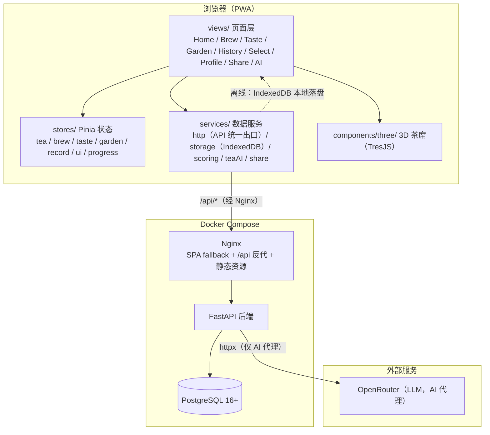
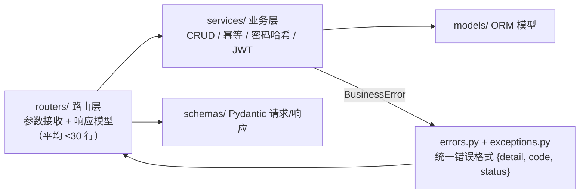
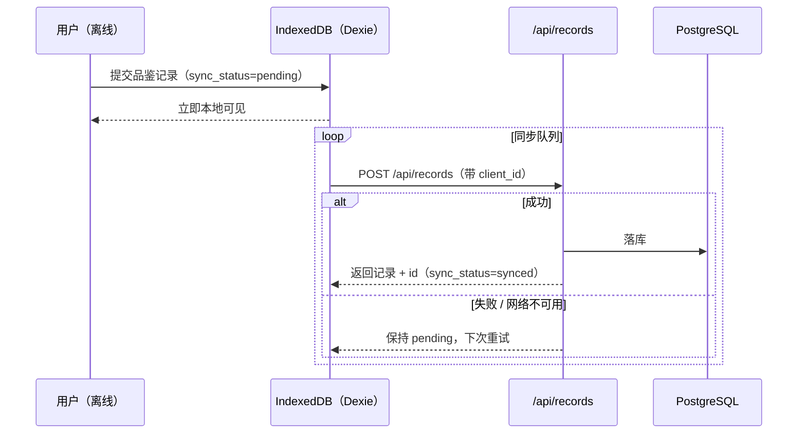
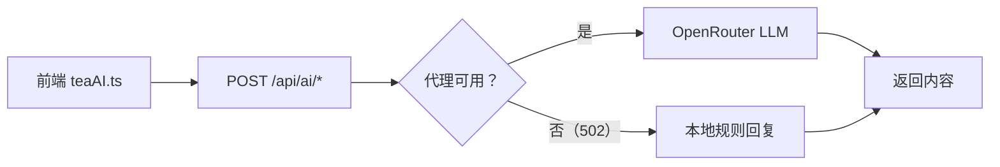

# 系统架构总览

> 「一盏茶」沉浸式在线茶道应用 — 前后端架构、业务域划分与核心数据流。
> 最后更新：2026-09-11（后端 service 层抽取完成之后）

## 1. 分层架构

## 2. 后端分层（业务逻辑下沉）

- **router 只做三件事**：声明路径与鉴权依赖、调用 service、声明响应模型。不写 `select().filter()`，不 raise `HTTPException`。
- **service 承载业务规则**：`base_service`（通用 CRUD）与 `tea / record / garden / auth` 四域 service；幂等（client_id 去重）、密码哈希（bcrypt）、JWT 签发均在 service 内。
- **统一异常**：service 抛 `BusinessError` 子类（BadRequestError 400 / UnauthorizedError 401 / NotFoundError 404 / ConflictError 409），`errors.py` 统一转成 `{detail, code, status}` 中文响应；HTTPException 仅保留在中间件与健康检查等系统层。

## 3. 业务域划分

| 域 | 前端状态 | 后端 service | 说明 |
|------|----------|--------------|------|
| 茶叶 | `stores/tea.ts` | `tea_service.py` | 六大茶类目录、产区/工艺关联详情 |
| 冲泡 | `stores/brew.ts` | —（纯前端状态机） | BrewPhase 流转、水温/投茶量/进度 |
| 品鉴 | `stores/taste.ts` + `progress.ts` | `record_service.py` | 四步流程、八维评分、成就判定 |
| 茶园 | `stores/garden.ts` | `garden_service.py` | 种茶/浇水/采摘，client_id 幂等 upsert |
| 记录 | `stores/record.ts` | `record_service.py` | 品鉴历史 CRUD + 离线同步队列 |
| 认证 | `stores/ui.ts`（会话） | `auth_service.py` | 注册/登录/JWT（30 天） |
| 茶文化 | `services/`（读取） | `culture_service.py` | 产区/茶人/茶诗/知识图谱/搜索 |
| 茶灵 AI | `services/teaAI.ts` | `ai.py`（代理） | LLM 代理 + 规则降级 |

## 4. 核心数据流

### 4.1 品鉴记录：离线优先同步

幂等约定：同 `user_id + client_id` 重复提交返回同一条记录，离线重试不会产生重复数据。

### 4.2 AI 茶灵：代理 + 降级

浏览器不直连第三方 AI；`/api/ai/recommend`（荐茶）/ `note`（茶记）/ `chat`（问答）统一走后端代理。

### 4.3 认证

注册 / 登录 → `auth_service` 校验（重复用户名 400、凭据错误 401 统一文案）→ 签发 JWT（HS256，30 天）→ 前端存本地，后续请求带 `Authorization: Bearer <token>`；`deps.get_current_user` 校验失败返回 401，前端拦截跳登录页。

## 5. 部署拓扑

- **Docker Compose**：`frontend`（Nginx 静态 + 反代）→ `backend`（uvicorn）→ `postgres`。
- **Nginx**：SPA fallback（`/` 回 index.html）、`/api` 反向代理到 backend、安全响应头、静态资源缓存。
- **PWA**：`vite-plugin-pwa` 生成 Service Worker，核心路由离线可访问。
- **CI（GitHub Actions 7 job 门禁）**：type-check + build + smoke / Vitest / Playwright E2E / 后端 pytest / 迁移测试（真实 Postgres）/ 语法编译 / Compose 校验。
