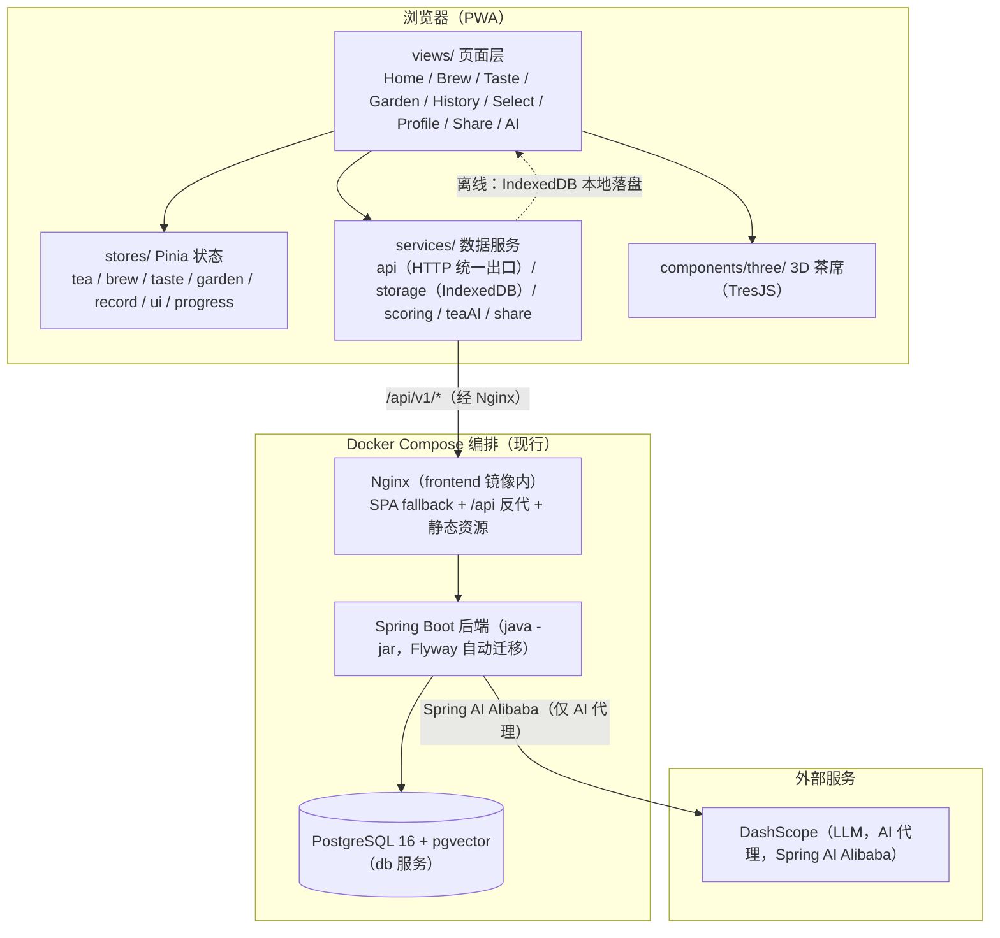
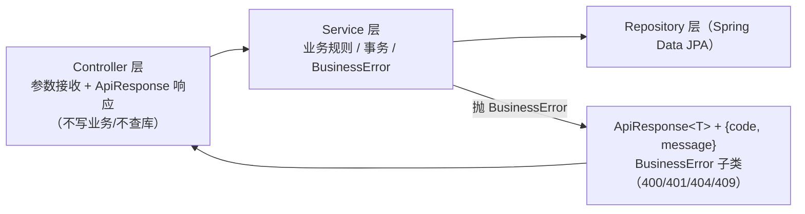
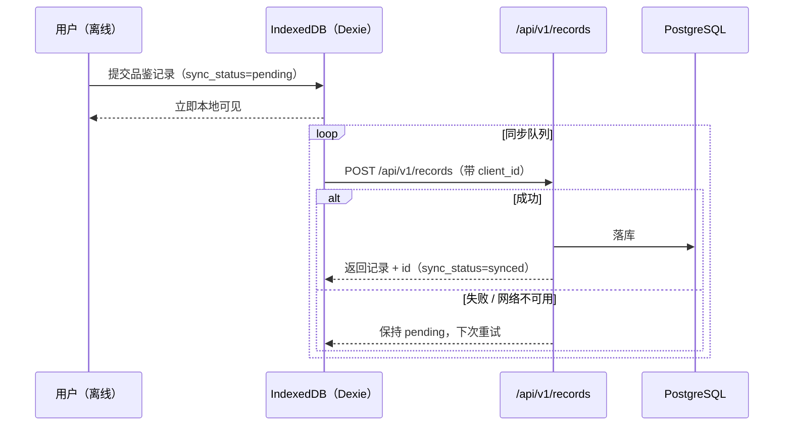
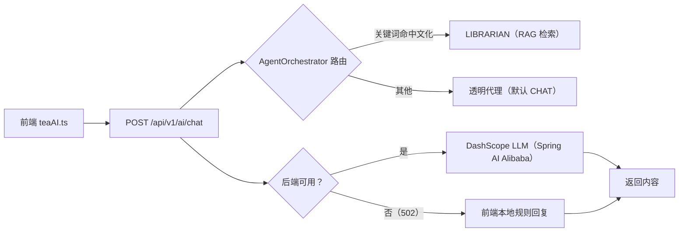

# 系统架构总览

> 「一盏茶」沉浸式在线茶道应用 — 前后端架构、业务域划分与核心数据流。
> 最后更新：2026-10-09（后端 Spring Boot 重写中：主仓库已实现 7 域；旧 FastAPI 仅维护不新增，结构见 `.harness/rules/工程结构.md`）

## 1. 分层架构


```mermaid
flowchart TB
    subgraph client["浏览器（PWA）"]
        views["views/ 页面层<br/>Home / Brew / Taste / Garden / History / Select / Profile / Share / AI"]
        stores["stores/ Pinia 状态<br/>tea / brew / taste / garden / record / ui / progress"]
        services["services/ 数据服务<br/>api（HTTP 统一出口）/ storage（IndexedDB）/ scoring / teaAI / share"]
        three["components/three/ 3D 茶席（TresJS）"]
        views --> stores
        views --> services
        views --> three
    end

    subgraph server["Docker Compose 编排（现行）"]
        nginx["Nginx（frontend 镜像内）<br/>SPA fallback + /api 反代 + 静态资源"]
        api["Spring Boot 后端（java -jar，Flyway 自动迁移）"]
        db[("PostgreSQL 16 + pgvector（db 服务）")]
        nginx --> api
        api --> db
    end

    subgraph external["外部服务"]
        llm["DashScope（LLM，AI 代理，Spring AI Alibaba）"]
    end

    services -- "/api/v1/*（经 Nginx）" --> nginx
    services -. "离线：IndexedDB 本地落盘" .-> views
    api -- "Spring AI Alibaba（仅 AI 代理）" --> llm
```

## 2. 后端分层（Spring Boot，目标结构）


```mermaid
flowchart LR
    controller["Controller 层<br/>参数接收 + ApiResponse 响应<br/>（不写业务/不查库）"]
    service["Service 层<br/>业务规则 / 事务 / BusinessError"]
    repo["Repository 层（Spring Data JPA）"]
    err["ApiResponse&lt;T&gt; + {code, message}<br/>BusinessError 子类（400/401/404/409）"]

    controller --> service
    service --> repo
    service -- "抛 BusinessError" --> err
    err --> controller
```

- **Controller 只做三件事**：声明路径与鉴权、调用 service、声明响应模型。分层由 ArchUnit 机械化强制（`LayerDependencyTest`，CI Maven test 门禁）。
- **Service 承载业务规则**：已实现 7 域 8 Service（ai / auth / common / culture / record / tea / ware；AiChatService / ChatMemoryService / PromptService / JwtService / AuthService / CultureSearchService / TastingRecordService / TeaService）。
- **统一异常**：Service 抛 BusinessError 子类，全局转 `ApiResponse<T>` 的 `{code, message}` 中文响应。
- **认证**：Spring Security + JWT（BCrypt 哈希）；旧 FastAPI 栈（routers/services/models/schemas + BusinessError）仅维护不新增。

## 3. 业务域划分（Spring Boot 现状）

| 域 | 前端状态 | 后端 Service | 说明 |
|------|----------|--------------|------|
| 茶叶 | `stores/tea.ts` | `TeaService` | 六大茶类目录、产区/工艺关联详情 |
| 冲泡 | `stores/brew.ts` | —（纯前端状态机） | BrewPhase 流转、水温/投茶量/进度 |
| 品鉴 | `stores/taste.ts` + `progress.ts` | `TastingRecordService` | 四步流程、八维评分、成就判定 |
| 茶园 | `stores/garden.ts` | garden 域（S1 能量账本，PR #40 待合 main） | 3D 景观 + 能量收集/阶段推进（S1） |
| 记录 | `stores/record.ts` | `TastingRecordService` | 品鉴历史 CRUD + 离线同步队列 |
| 认证 | `stores/ui.ts`（会话） | `AuthService` + `JwtService` | 注册/登录/JWT（Spring Security） |
| 茶文化 | `services/`（读取） | `CultureSearchService` | 产区/茶人/茶诗/搜索（RAG 检索） |
| 茶灵 AI | `services/teaAI.ts` | `AiChatService` | 五专家路由 + RAG + 降级承重墙 |
| 器具 | — | ware 域（并入 tea 相关服务） | 茶器数据（重写中覆盖） |

## 4. 核心数据流

### 4.1 品鉴记录：离线优先同步


```mermaid
sequenceDiagram
    participant U as 用户（离线）
    participant IDB as IndexedDB（Dexie）
    participant API as /api/v1/records
    participant PG as PostgreSQL

    U->>IDB: 提交品鉴记录（sync_status=pending）
    IDB-->>U: 立即本地可见
    loop 同步队列
        IDB->>API: POST /api/v1/records（带 client_id）
        alt 成功
            API->>PG: 落库
            API-->>IDB: 返回记录 + id（sync_status=synced）
        else 失败 / 网络不可用
            API-->>IDB: 保持 pending，下次重试
        end
    end
```

幂等约定：同 `user_id + client_id` 重复提交返回同一条记录，离线重试不会产生重复数据。

### 4.2 AI 茶灵：五专家路由 + 降级承重墙


```mermaid
flowchart LR
    A["前端 teaAI.ts"] --> B["POST /api/v1/ai/chat"]
    B --> C{"AgentOrchestrator 路由"}
    C -- 关键词命中文化 --> D["LIBRARIAN（RAG 检索）"]
    C -- 其他 --> E["透明代理（默认 CHAT）"]
    F{"后端可用？"}
    B --> F
    F -- 是 --> G["DashScope LLM（Spring AI Alibaba）"]
    F -- 否（502） --> H["前端本地规则回复"]
    G --> I["返回内容"]
    H --> I
```

- 浏览器不直连第三方 AI；`POST /api/v1/ai/chat` 统一代理（前端 `askTeaMaster` / `generateTastingNote` / 荐茶内部走 chat）。
- 五专家：CHAT / ADVISOR / TASTER / LIBRARIAN / BREWER / MENTOR（单请求单专家路由，非接力流水线）。
- 会话记忆（`ChatMemoryService`，历史锚定 ≤20 条）+ Prompt 版本化（`PromptService`，agent_prompts 表）+ 计量（ai_usage_logs）+ 降级（502 → 规则回复，承重墙不可动）。

### 4.3 认证

注册 / 登录 → `AuthService` 校验（重复用户名 400、凭据错误 401 统一文案）→ `JwtService` 签发 JWT → 前端存本地，后续请求带 `Authorization: Bearer <token>`；Spring Security 过滤器链校验失败返回 401，前端拦截跳登录页。

## 5. 部署拓扑

- **Docker Compose 编排（现行）**：db / backend / frontend 三服务（nginx 并入 frontend 镜像），详见 `DEPLOY.md`；旧 Windows 原生脚本（NSSM + nginx for Windows）保留参考。
- **Nginx**：SPA fallback（`/` 回 index.html）、`/api` 反向代理到 backend、安全响应头、静态资源缓存。
- **PWA**：`vite-plugin-pwa` 生成 Service Worker，核心路由离线可访问。
- **CI（GitHub Actions 13 job 门禁）**：type-check + build + smoke / Vitest / Biome / npm+pip audit / E2E / axe / 后端语法 / pytest / ruff+bandit / Spring Boot Maven / 迁移测试 / Compose 校验 / harness 一致性。

## 6. 目录速查

```
src/
├── views/          页面（路由目标）
├── components/     可复用组件
├── composables/    组合式函数（逻辑复用）
├── stores/         Pinia 状态
├── services/       API / IndexedDB / 评分 / AI
├── data/           静态数据（茶、茶器、节气、文化）
├── types/          TypeScript 类型
├── router/         路由 + 冲泡流程守卫
├── plugins/        Vue 插件
└── assets/         静态资源

backend/（Spring Boot，Maven）
└── src/main/java/com/tea/
    ├── ai/         AI 茶灵（五专家 / 编排 / 记忆 / 工具 / 计量）
    ├── auth/       认证（Security + JWT）
    ├── common/     通用（ApiResponse / 异常）
    ├── culture/    文化检索（RAG）
    ├── record/     品鉴记录
    ├── tea/        茶叶目录
    ├── ware/       茶器
    └── resources/db/migration/   Flyway 迁移（V1~V4）

docs/
├── ADR/            架构决策记录（ADR-001~015，独立文件）
├── architecture/   系统架构总览
├── prd/            需求分析（REQ-*）
├── plans/          迭代计划（PLAN-* / TODO-PRIORITY）
├── reference/      稳定参考
└── skills/         核心技能人读审查页
```
